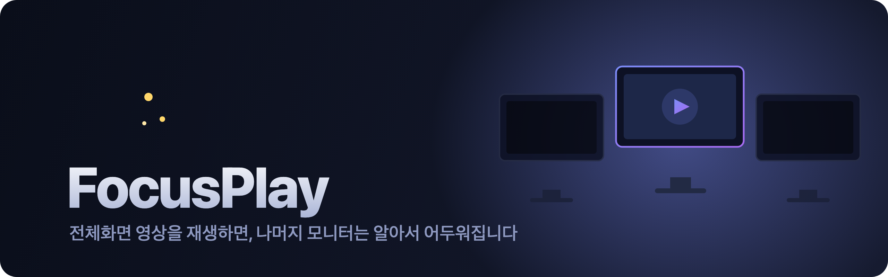
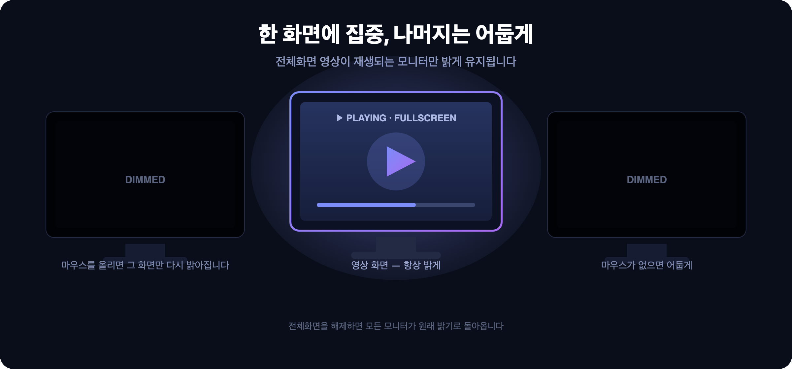

<p align="center">
  
</p>

<p align="center">
  <a href="README.md">한국어</a> · <b>English</b>
</p>

<p align="center">
  
  
  
  
  
</p>

# FocusPlay

A macOS menu bar app that **automatically dims your other monitors when a video plays fullscreen on one of them**. While you focus on the video, the bright screens on your other displays no longer distract you.

<p align="center">
  
</p>

## Features

- 🎬 **Automatic fullscreen video detection** — only the monitor playing fullscreen video stays bright; the rest are covered with a black overlay.
- 🖱️ **Follows your mouse** — move the cursor onto a dimmed monitor and it brightens again; move away and it dims back.
- 🔄 **Auto restore** — exit fullscreen and every monitor returns to its original brightness.
- 🎯 **Video only** — fullscreen text editors, documents, and other non-video apps are *not* dimmed.
- 🌗 **Adjustable dim strength** — 70 / 85 / 92 / 98 / 100% (default 98%).
- ⏸️ **Pause behavior option** — choose whether to brighten when playback pauses (default: stay dimmed while fullscreen is held).
- 🔒 **No permissions required** — works without Accessibility or Screen Recording permissions.
- 🌐 **Localized** — Korean, English, Japanese, Chinese (Simplified/Traditional), Spanish, Hindi.

## Install & Run

### Quick run (development)

```bash
swift run
```

A 🌙 icon appears in the menu bar (it does not show in the Dock).

### Build a distributable app

```bash
./scripts/build-app.sh
```

This produces `build/FocusPlay.app`. Move it to `/Applications`. To launch at login, add it under **System Settings → General → Login Items**.

> The app is unsigned, so on first launch right-click → **Open** to allow it past Gatekeeper.

## Usage

Click the 🌙 menu bar icon:

| Menu | Description |
|------|-------------|
| **Automatic (detect fullscreen)** | Detect fullscreen video and dim automatically (default) |
| **Manual toggle** (`⌘D`) | Dim the monitors without the mouse, without video detection |
| **Off** | Disable |
| **Dim strength** | Choose 70 – 100% |
| **Brighten when playback pauses** | When on, brightens as soon as playback pauses (default off) |

## How it works

"Fullscreen video" is determined by combining two signals — a window that fills the screen (fullscreen), and a sign that video is playing on that screen.

- **Fullscreen detection**: `CGWindowList` finds an app window that covers the screen (including the menu bar area). A regular maximized window starts below the menu bar, so it is excluded; on notched MacBook displays the menu bar height (`safeAreaInsets`) is compensated for.
- **Video detection**:
  - Native video players (IINA, QuickTime, VLC, etc.) are recognized **by app name**.
  - Browsers and PWAs (YouTube, Disney+, etc.) are recognized by the **display-sleep prevention assertion** they hold while playing (`IOPMCopyAssertionsByProcess`). For PWAs the window process and the assertion process differ, so instead of matching PIDs the two signals are debounced and combined independently.
- **Overlay**: a `borderless` black window covers each monitor, floats above fullscreen Spaces (`fullScreenAuxiliary`), and passes clicks through.

### Supported video players

IINA · QuickTime Player · VLC · mpv · Movist / Movist Pro · Infuse · Elmedia Player · PotPlayer
plus any browser or PWA that holds a video-playback assertion (Chrome · Safari · YouTube · Disney+, etc.).

> To add a player that isn't listed, add its app name to `videoPlayers` in `DimController.swift`.

## Requirements

- macOS 13 (Ventura) or later
- Swift 6.0 toolchain (Xcode 16+)

## Project structure

```
Sources/FocusPlay/
├── main.swift               # Entry point (.accessory policy = menu bar only)
├── AppDelegate.swift        # Menu bar UI
├── DimController.swift      # Polling, signal combination, overlay dimming
├── FullscreenDetector.swift # Collects fullscreen + video-playback signals
├── OverlayWindow.swift      # Black overlay window covering a monitor
└── Localization.swift       # Localized string helper
```
